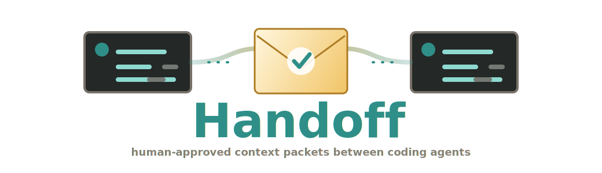
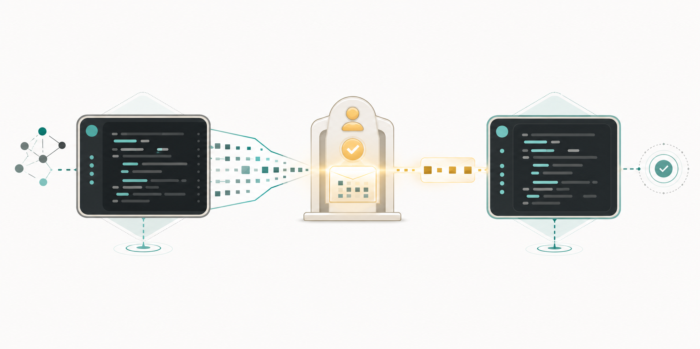

<div align="center">
  <p>
    
  </p>

  <h1>Handoff</h1>

  <p><strong>Human-approved context packets for coding agents.</strong></p>

  <p>Move only the selected context you approved from one teammate's coding agent to another.</p>

  <p>
    <a href="https://www.npmjs.com/package/handoff-relay"></a>
    <a href="https://www.npmjs.com/package/handoff-relay"></a>
    
    
    
    
  </p>

  <p>
    <a href="#quick-start">Quick start</a> |
    <a href="#how-it-works">How it works</a> |
    <a href="#use-with-agents">Use with agents</a> |
    <a href="#security-model">Security</a> |
    <a href="#architecture">Architecture</a> |
    <a href="#docs">Docs</a>
  </p>
</div>

---

<p align="center">
  
</p>

Handoff is not a chat room, passive team memory, or an autonomous agent-to-agent channel. It is a local-first relay for structured Relay Packets: the sending agent drafts context, the sender reviews and approves it, the recipient reviews it, and only then does the recipient's agent hydrate bounded context into its own session.

Use it when one agent has the investigation and another teammate's agent needs the usable, reviewed parts without a raw transcript dump.

## Quick Start

Most teams need one host command and one join command. Setup starts packet notifications automatically.

Host/admin:

```bash
npx -y handoff-relay start --lan --install-mcp codex --invite alice
```

Use `--install-mcp claude` for Claude Code or `--install-mcp cursor` for Cursor.

Teammate:

```bash
npx -y handoff-relay join <invite-link> --install-mcp codex
```

Check the setup:

```bash
npx -y handoff-relay doctor
```

After that, use Handoff inside your coding agent:

```text
Use Handoff to package this investigation for @alice.
Show me the Relay Packet and redaction report before sending.
If I approve, call relay_send_approved.
```

```text
Use Handoff to check my inbox.
Show me the next Relay Packet before hydration.
If I approve, call relay_hydrate_approved.
```

Manage packet notifications:

```bash
npx -y handoff-relay watch --status
npx -y handoff-relay watch --stop
```

## How It Works

```text
sender agent
  -> selected investigation context
  -> Relay Packet draft
  -> human review and send approval
  -> teammate inbox
  -> recipient review and hydrate approval
  -> recipient agent continues with bounded context
```

Relay Packets keep claims, evidence, files, commands, hypotheses, failures, and next steps separate. That makes the packet reviewable by a human and usable by another agent.

| Handoff protects | How                                                               |
| ---------------- | ----------------------------------------------------------------- |
| Scope            | Agents send selected packet fields instead of raw transcripts.    |
| Consent          | Sender approval before send, recipient approval before hydration. |
| Trust            | Claims are linked to evidence and audit receipts.                 |
| Secrets          | Redaction blocks secret-looking content by default.               |
| Ownership        | Teams self-host with local profiles and SQLite by default.        |

## When To Use It

- A teammate's agent needs the exact debugging state from your agent.
- You want another agent to continue an investigation without reconstructing context from Slack.
- You need a reviewable artifact that says what is known, what failed, and what to try next.
- You want approvals, redaction, and receipts around agent-to-agent context movement.

## Team Setup

### Host The Workspace

Pick the machine that will host Handoff. For a small team this can be a teammate's machine on the LAN. For a more reliable setup, use a stable internal host or VPN-reachable machine.

```bash
npx -y handoff-relay start --lan --install-mcp codex --invite alice --invite bob
```

This creates:

- the shared Handoff workspace
- the host/admin member
- the SQLite coordination database
- a reachable server URL
- the host's local profile
- an MCP config when `--install-mcp codex`, `--install-mcp claude`, or `--install-mcp cursor` is used
- automatic profile-based packet notifications

Add more teammates later:

```bash
npx -y handoff-relay invite priya
```

Rerunning `start --invite alice` or `invite alice` before Alice joins reprints the same active invite instead of creating a duplicate.

### Join A Workspace

Each teammate runs their invite command on their own machine:

```bash
npx -y handoff-relay join http://<handoff-host>:3737/invite/<invite-token> --install-mcp codex
```

Members using Claude Code or Cursor can swap the MCP install flag:

```bash
npx -y handoff-relay join <invite-link> --install-mcp claude
npx -y handoff-relay join <invite-link> --install-mcp cursor
```

Run `doctor` after joining. `WARN mcp_config` means the profile and server work, but the coding agent is not wired to Handoff yet.

## Use With Agents

The CLI exists for setup, health checks, admin work, approval tokens, and debugging. Normal handoffs happen through MCP tools inside Codex, Claude Code, Cursor, or another MCP-capable coding agent.

Profile-backed MCP command:

```bash
npx -y handoff-relay server mcp --profile default
```

MCP JSON:

```json
{
  "mcpServers": {
    "handoff": {
      "command": "npx",
      "args": ["-y", "handoff-relay", "server", "mcp", "--profile", "default"]
    }
  }
}
```

Codex TOML:

```toml
[mcp_servers.handoff]
command = "npx"
args = ["-y", "handoff-relay", "server", "mcp", "--profile", "default"]
startup_timeout_sec = 10
tool_timeout_sec = 60
enabled = true
```

Profile mode reads the active local Handoff profile. Agents do not need member tokens, workspace IDs, database paths, server URLs, or approval secrets in prompts or MCP schemas.

## Agent Prompts

Sender:

```text
Use Handoff to package this investigation for @bob.
Include files touched, commands run, known failures, current hypothesis, evidence excerpts, and suggested next steps.
Draft with relay_share or relay_ask. Show me the Relay Packet and redaction report before sending.
If I approve, call relay_send_approved.
```

Recipient:

```text
Use Handoff to check my inbox.
Call relay_review_next, then show me the Relay Packet and redaction report.
If I approve, call relay_hydrate_approved.
```

Host/admin setup:

```text
Set up Handoff as the host/admin for my team.
Use npx -y handoff-relay.
Start a reachable workspace with start --lan --install-mcp codex --invite <teammate>.
Repeat --invite for each teammate I name.
Run doctor and do not call setup complete until my coding agent can see the Handoff MCP tools.
```

Member setup:

```text
Set up my machine as a Handoff team member.
Use npx -y handoff-relay.
Run the join command my teammate sent me with --install-mcp codex.
Run doctor and do not call setup complete until my coding agent can see relay_review_next and relay_hydrate_approved.
```

## MCP Tools

| Workflow | Tools                                                                          |
| -------- | ------------------------------------------------------------------------------ |
| Send     | `relay_share`, `relay_ask`, `relay_update_draft`, `relay_send_approved`        |
| Receive  | `relay_review_next`, `relay_hydrate_approved`, `relay_inbox`, `relay_review`   |
| Fallback | `relay_status`, `relay_view`, `relay_accept`, `relay_hydrate`, `relay_approve` |
| Reply    | `relay_reply`, `relay_send_approved`                                           |
| Triage   | `relay_clarify`, `relay_decline`, `relay_archive`                              |
| Search   | `relay_search`, `relay_history`, `relay_audit`                                 |
| Admin    | `relay_configure_project_alias`, `relay_project_aliases`                       |

New agents should prefer the send and receive recipes above. Fallback tools remain available for automation and compatibility.

## Approval Flow

Strict mode is the default. Agents can draft and read packets, but send, hydrate, and reply actions require a human approval token:

```bash
npx -y handoff-relay approval-token <packet-id> --action send
npx -y handoff-relay approval-token <packet-id> --action hydrate
npx -y handoff-relay approval-token <reply-packet-id> --action reply
```

Agent-confirmed mode is optional for profile-backed MCP sessions:

```bash
npx -y handoff-relay server mcp --profile default --agent-approvals
```

In that mode, the MCP process requests the same short-lived approval token through the configured Handoff backend after the agent shows you the packet and you explicitly tell it to send, approve, or hydrate. Approval secrets stay out of MCP schemas and config.

## Packet Shape

```json
{
  "packet_type": "share",
  "title": "Auth refresh handoff",
  "summary": "The refresh-token retry path still returns 401 after rotation.",
  "finding": "The retry path appears to skip persistence before the second request.",
  "source_client": "codex",
  "files_or_symbols": ["src/auth/refresh.ts", "refreshSession"],
  "commands_or_tests_run": ["pnpm test auth-refresh"],
  "what_was_tried": ["Checked token expiry math", "Re-ran the refresh integration test"],
  "known_failures": ["expected 200 received 401"],
  "current_hypothesis": "Refresh persistence ordering issue.",
  "suggested_next_steps": ["Trace where the rotated token is written before retry"]
}
```

Full schema notes: [docs/packet-schema.md](docs/packet-schema.md).

## Demo

Run the two-user local demo:

```bash
npx -y handoff-relay demo two-user --json
```

The demo exercises ask, share, reply, review, hydration, archive, and audit receipts in one local SQLite-backed flow. A short recording script lives in [docs/demo-video-script.md](docs/demo-video-script.md).

## Security Model

- Sender approval is required before ask/share packets leave the sender.
- Recipient acceptance and approval are required before ask/share packets hydrate.
- Reply approval is required before recipient-agent output returns to the sender.
- Strict mode requires manual approval tokens; optional agent-confirmed mode keeps approval secrets profile-backed.
- Approval secrets are not exposed through MCP schemas or config.
- Secret-looking content blocks sending by default.
- Raw transcripts are not shared by default.
- Packet access is enforced in the service and storage layer, not only in MCP filtering.
- Audit and hydration receipts record packet movement.

More detail: [docs/security-privacy.md](docs/security-privacy.md) and [SECURITY.md](SECURITY.md).

## Architecture

```text
CLI setup/admin
  -> profiles and local credentials
  -> Fastify coordination API or local SQLite service
  -> RelayService state machine
  -> packet storage, audit receipts, hydration receipts

MCP stdio server
  -> profile-backed auth context
  -> RelayService or API client
  -> coding-agent tools
```

The public contract is the Relay Packet model and approval-gated workflow. Internal A2A adapter infrastructure may map packets into task/artifact metadata inside Handoff, but Handoff does not expose public A2A protocol support or public A2A endpoints.

Architecture notes: [docs/architecture.md](docs/architecture.md).

## Local Self-Hosting

For a small LAN team:

```bash
npx -y handoff-relay start --lan --invite alice
```

For a stable internal host:

```bash
npx -y handoff-relay server start \
  --db /srv/handoff/relay.db \
  --host 10.0.0.10 \
  --port 3737
```

See [docs/local-self-hosting.md](docs/local-self-hosting.md) and [docs/advanced-manual-setup.md](docs/advanced-manual-setup.md).

## Launch Assets

This repo includes the public launch assets used by the README and Product Hunt kit:

- `assets/readme/handoff-relay-packet-wordmark.svg`
- `assets/readme/handoff-packet-transit-hero.png`
- `assets/readme/handoff-human-gate-monogram.svg`
- `assets/readme/handoff-ascii-banner.svg`
- `assets/readme/handoff-ascii-banner.txt`
- `assets/readme/product-hunt-gallery-hero.png`
- `assets/readme/product-hunt-thumbnail.png`
- [docs/product-hunt-launch-kit.md](docs/product-hunt-launch-kit.md)
- [docs/launch-copy.md](docs/launch-copy.md)

## Docs

- [Codex setup](docs/codex-setup.md)
- [Claude Code setup](docs/claude-code-setup.md)
- [Generic MCP setup](docs/generic-mcp-setup.md)
- [Local self-hosting](docs/local-self-hosting.md)
- [Advanced manual setup](docs/advanced-manual-setup.md)
- [Packet schema](docs/packet-schema.md)
- [Architecture](docs/architecture.md)
- [Security and privacy model](docs/security-privacy.md)
- [Troubleshooting](docs/troubleshooting.md)
- [Product Hunt launch kit](docs/product-hunt-launch-kit.md)

## Run From Source

```bash
pnpm install
pnpm build
pnpm check
```

The package ships `dist`, public docs, launch assets, examples, fixtures, and this README.

## Current Limits

- Handoff does not provide a hosted cloud service. You host the workspace/server.
- Slack is not a first-class adapter. Handoff replaces raw paste/chat handoff with human-approved Relay Packet handoff between MCP-connected coding agents.
- A2A is internal adapter infrastructure only. Handoff does not expose public A2A protocol support, public A2A endpoints, or an external A2A compatibility promise.
- Literal client-specific slash command registration is not shipped. Use MCP tools and optional local command templates in your client.
- SQLite is the default storage for local/self-hosted teams. Postgres is intentionally left as a future storage adapter.
- Handoff does not passively capture sessions, build a team memory index, or apply another teammate's patch automatically.

## Contributing

Contributions are welcome. Start with [CONTRIBUTING.md](CONTRIBUTING.md), keep the approval-gated packet model intact, and run `pnpm check` plus the relevant smoke commands before opening a PR.

## License

MIT.
